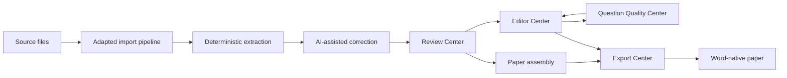

# DQ QuestionBank Core

[](https://github.com/wzsisshadiao-crypto/dq-questionbank-core/actions/workflows/ci.yml)
[](https://www.python.org/)
[](LICENSE)
[](https://github.com/wzsisshadiao-crypto/dq-questionbank-core/releases)

An open, local-first question-bank workspace built around the complete life of a
question, from source document to reviewed Word paper.

DQ QuestionBank Core is the public foundation and migration home of a mature
question-bank application. Today this repository provides a database-neutral
Python library, CLI, visual local workspace, canonical schema, format adapters,
and a synthetic SQLite case. The larger application already exercises a much
broader workflow: process-based document intake, bounded AI correction, a Review
Center, paper assembly, field-level editing, continuous quality inspection, and
Word-centered publishing. Those product modules are being extracted here in
reviewable stages.

The repository never includes the production question bank, private user data,
credentials, provider configuration, or operational records. Question content
may be multilingual; the maintained public interface and documentation are
English-only.

## The question lifecycle

The project treats a question as a traceable object that moves through explicit
states, not as text copied from one editor into another.



1. **Import:** a source-specific pipeline reads Word, structured files, or other
   inputs and preserves source evidence before normalization. Import behavior is
   intentionally adaptable: a school, publisher, or individual can implement a
   pipeline for its own document conventions instead of rewriting the question
   bank.
2. **Structure and AI correction:** deterministic parsing identifies question
   boundaries, fields, formulas, images, and tables. AI may then propose bounded
   repairs, but it does not replace the source evidence or silently write into
   storage.
3. **Review and assemble:** candidates enter the Review Center for human
   acceptance. Reviewers can inspect a question in context, classify it, and
   assemble questions, including questions sharing a source, into a paper.
4. **Edit and inspect:** the Editor Center provides field-level work on the stem,
   options, answer, analysis, solution, formulas, images, tables, and metadata.
   The Question Quality Center detects issues across the bank, sends a finding
   directly to the editor, and rechecks the saved result.
5. **Export:** canonical JSON, Markdown, LaTeX, and conventional DOCX are portable
   interchange paths. In the mature application, the primary high-fidelity path
   is a local Word macro workflow: questions are inserted as refreshable Word
   reference boxes, formulas become native Word math (OMML), and images, tables,
   option layout, answers, analysis, and solutions can be rendered into an
   editable paper. Reference-box borders can be shown while composing and hidden
   for the final document.

Read [Product Workflow and Public Migration](docs/product-workflow.md) for the
detailed journey of one question, the import extension model, the Word macro
workflow, and the exact public migration boundary.

## What is available now

| Area | In this repository today | Mature application / public migration |
|---|---|---|
| Data model | Versioned canonical schema, validation, migrations, compatibility fixtures | Mapping more application fields without coupling to the production database |
| Import | JSON, Markdown, LaTeX, and convention-based DOCX adapters | Process-based Word/PDF intake, source evidence, candidate sessions, bounded AI correction |
| Visual frontend | Question Bank view with collection browsing, search and filters, question details, offline math and table rendering, answer review, basic editing, and canonical JSON exchange | Review Center, paper assembly, full Editor Center, Question Quality Center, and Export Center |
| Storage | Atomic filesystem adapter and read-only reviewed SQLite case adapter | User-selected local database adapters behind the same canonical boundary |
| Export | JSON, Markdown, LaTeX, and conventional DOCX | High-fidelity Word macro/reference-box publishing workflow |
| AI | Stable provider protocol; no bundled provider or credential | Provider-neutral candidate correction with explicit review and validation gates |

The right column describes working product behavior that is being migrated; it
is not a claim that those modules are already downloadable from this repository.

## Why it exists

Question banks often become inseparable from one database schema, editor, document format, or AI service. This project provides a small interchange core that can sit between those systems:

```text
JSON / Markdown / LaTeX / DOCX
                |
                v
       Importer interface
                |
                v
      Canonical Question Model
                |
        Validation / adapters
                |
                v
       Exporter interface
                |
                v
JSON / Markdown / LaTeX / DOCX
```

The core is only the first layer. The broader design keeps five concerns
independent: source extraction, canonical question meaning, review state,
storage, and document presentation. This separation is what allows the same
question to be re-parsed, AI-corrected, manually reviewed, quality-checked,
assembled into different papers, and refreshed inside Word without making one
database table or one AI service the definition of the question.

## Features

- Versioned, JSON-serializable Question Schema (`1.0`)
- Single choice, multiple choice, true/false, fill-blank, short-answer, essay, and composite questions
- Rich content blocks for text, LaTeX math, images, tables, code, and line breaks
- Asset integrity metadata and safe relative-path validation
- Source attribution, taxonomy references, tags, difficulty, hints, solutions, and extensions
- Deterministic JSON, Markdown, and generated-LaTeX round trips
- Convention-based DOCX import/export with image extraction
- `QuestionImporter`, `QuestionExporter`, `StorageAdapter`, and `AIProvider` interfaces
- Reference local filesystem storage with atomic canonical JSON writes
- English-language CLI, lightweight playground, and local Question Bank workspace
- Reviewed read-only SQLite case adapter and bundled synthetic database case
- No database, frontend framework, or AI provider lock-in

## Visual quick start

Python 3.10 or newer is the only requirement for a downloaded source archive:

```bash
python run.py
```

The command starts a loopback-only server, creates an ignored local workspace,
and opens `http://127.0.0.1:8766`. Choose **Open public case** to enter the
Question Bank with four original synthetic questions. The interface provides
collection and question navigation, text search, subject and type filters,
structured tables, offline KaTeX math, choices, answers, solutions, and a basic
editor. Import, edit, save, and export operations stay on the local computer.

To offer another independently reviewed case:

```bash
python run.py --case-database ./downloaded-case.sqlite3
```

See [`docs/database-case.md`](docs/database-case.md) for the supported schema and
mandatory publication review.

## Library installation

From a clone:

```bash
python -m venv .venv
python -m pip install -e ".[docx]"
```

For development:

```bash
python -m pip install -e ".[docx,dev]"
```

Python 3.10, 3.11, and 3.12 are the supported versions.

## Core CLI quick start

Validate the synthetic sample:

```bash
dq validate examples/sample_questions.json
```

Convert canonical JSON to Markdown or LaTeX:

```bash
dq convert examples/sample_questions.json --output-format markdown -o questions.md
dq convert examples/sample_questions.json --output-format latex -o questions.tex
```

Import a DOCX document:

```bash
dq import exam.docx -o questions.json --assets-dir imported_assets
```

Launch the lightweight, English-language canonical JSON playground:

```bash
dq serve
```

Then open `http://127.0.0.1:8765`. The playground processes JSON in the browser and does not upload content.

## Basic library usage

```python
from pathlib import Path

from dq_questionbank.registry import default_registry
from dq_questionbank.validation import validate_question_set

registry = default_registry()
question_set = registry.importer("json").load(Path("questions.json"))
issues = validate_question_set(question_set)

if not issues:
    registry.exporter("markdown").dump(question_set, Path("questions.md"))
```

## Question Schema example

```json
{
  "schema_version": "1.0",
  "id": "math-001",
  "type": "single_choice",
  "language": "en",
  "subject": "Mathematics",
  "stem": {
    "blocks": [
      { "type": "text", "text": "Solve " },
      { "type": "math", "latex": "x + 3 = 7" }
    ]
  },
  "choices": [
    { "id": "A", "content": { "blocks": [{ "type": "text", "text": "3" }] } },
    { "id": "B", "content": { "blocks": [{ "type": "text", "text": "4" }] } }
  ],
  "answer": { "kind": "choice", "value": "B" }
}
```

The normative JSON Schema is at [`schema/question-set.schema.json`](schema/question-set.schema.json). Design notes are in [`docs/question-schema.md`](docs/question-schema.md).

Installed applications can load the same schema with `dq_questionbank.load_schema()`.

## Import and export behavior

| Format | Import | Export | Round-trip level |
|---|---:|---:|---|
| JSON | Yes | Yes | Canonical and deterministic |
| Markdown | Yes | Yes | Canonical for generated files |
| LaTeX | Yes | Yes | Canonical for generated files; basic `enumerate` fallback |
| DOCX | Yes | Yes | Core fields for the documented convention; formatting is best effort |

Human document formats are not lossless containers for every source-specific feature. Generated Markdown and LaTeX include machine-readable markers. DOCX intentionally uses visible labels and extracts embedded images. See [`docs/compatibility.md`](docs/compatibility.md).

## Architecture

- `models.py`: canonical, recursive data model
- `validation.py`: structural and safety rules (plus unified `validate_with_schema()`)
- `exceptions.py`: catchable error hierarchy (`QuestionBankError` and subtypes)
- `migration.py`: schema version migration framework
- `interfaces.py`: extension contracts
- `storage.py`: reference local filesystem storage adapter
- `registry.py`: built-in format discovery with protocol enforcement
- `formats/`: JSON, Markdown, LaTeX, and DOCX adapters
- `cli.py`: thin command wrapper over the library
- `web/`: static local playground; no server-side data storage
- `dq_questionbank_local/`: visual workspace, HTTP API, and reviewed case adapter

See [`OPEN_SOURCE_BOUNDARY.md`](OPEN_SOURCE_BOUNDARY.md) for the public/private boundary and [`docs/oss-architecture-proposal.md`](docs/oss-architecture-proposal.md) for design rationale.

### Distinctive design choices

- **Evidence before inference:** deterministic extraction and retained source
  context come before AI suggestions.
- **Candidates before persistence:** parsing, correction, review, and storage are
  separate transitions, so a plausible parse is not automatically trusted.
- **One canonical meaning, many surfaces:** the visual editor, quality rules,
  storage adapters, CLI, and exporters exchange the same versioned model.
- **Replaceable intake:** importer protocols, explicit plugin discovery, and
  source-specific profiles allow independently designed ingestion workflows.
- **Quality as a loop:** findings can open the exact question and field in the
  editor, then be re-evaluated against the saved revision.
- **Word as a first-class publishing surface:** the planned public macro bridge
  treats a paper as refreshable document blocks with native Word formulas, not a
  one-time text dump.

## Development

```bash
python -m unittest discover -s tests -v
python -m ruff check src tests scripts run.py
python -m build
python scripts/audit_public_tree.py
python scripts/check_docs.py
```

The test suite covers model serialization, schema conformance, validation, unsafe asset paths, CLI behavior, format round trips, DOCX conversion, composite questions, formulas, documentation links, English-only public interface, both browser applications, SQLite case safety, and the exception hierarchy.

## Compatibility

Python 3.10-3.12. See [`docs/compatibility.md`](docs/compatibility.md) for format-specific notes,
[`docs/public-api.md`](docs/public-api.md) for the stable Python API, and
[`docs/filesystem-storage.md`](docs/filesystem-storage.md) for the local reference adapter.

## Language policy

English is the single normative language for the public API, CLI, playground,
documentation, and repository-maintained Wiki. This keeps one reviewable public
contract; it does not restrict multilingual question content. See
[`docs/language-policy.md`](docs/language-policy.md).

## Roadmap

See [`docs/roadmap.md`](docs/roadmap.md).

## Contributing and security

Read [`CONTRIBUTING.md`](CONTRIBUTING.md) before opening an issue or pull request. Report vulnerabilities according to [`SECURITY.md`](SECURITY.md); do not place secrets, personal data, or copyrighted exam banks in public issues.

## License

Apache License 2.0. See [`LICENSE`](LICENSE).
