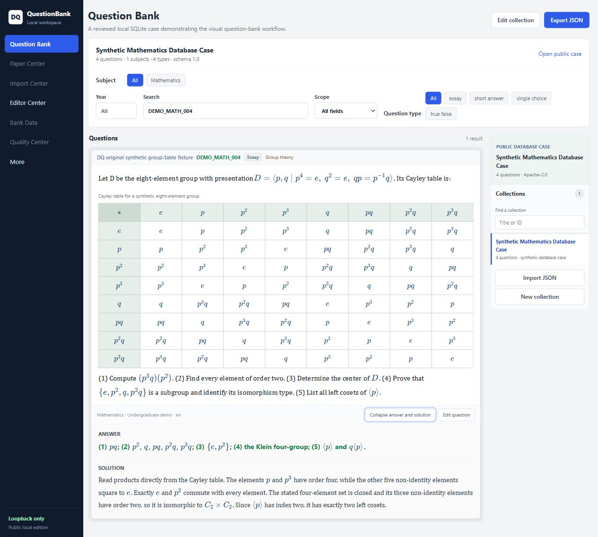
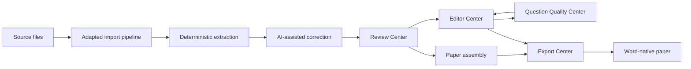

# DQ QuestionBank Core

**English** | [简体中文](README.zh-CN.md) | [Product site](https://wzsisshadiao-crypto.github.io/dq-questionbank-core/en/)

[](https://github.com/wzsisshadiao-crypto/dq-questionbank-core/actions/workflows/ci.yml)
[](https://www.python.org/)
[](LICENSE)
[](https://github.com/wzsisshadiao-crypto/dq-questionbank-core/releases)


> **Community fixture call: help us test every legal question format.**
>
> We are actively collecting small, legally redistributable question specimens for import, rendering, editing, validation, and export testing. Original/synthetic, public-domain, openly licensed, and contributor-owned material are welcome across text, structured data, LaTeX/MathML, DOCX/ODT, PDF/scans, tables, images, QTI, malformed, Unicode, multilingual, and mixed-format inputs.
>
> **Start here:** [propose a fixture in the pinned community Issue #28](https://github.com/wzsisshadiao-crypto/dq-questionbank-core/issues/28) · [read the provenance and format guide](docs/test-fixture-contributions.md)
>
> Do not upload private data, production database extracts, credentials, or content whose redistribution rights are unclear. A public URL alone is not permission to copy.
**Three tasks we recommend right now**

- **No code (LaTeX only):** [share one complex formula missing a single component](https://github.com/wzsisshadiao-crypto/dq-questionbank-core/issues/43)
- **15-minute fixture:** [add a blank-cell table fixture](https://github.com/wzsisshadiao-crypto/dq-questionbank-core/issues/37)
- **Small coding task:** [add a source-year filter regression test](https://github.com/wzsisshadiao-crypto/dq-questionbank-core/issues/9)

New small tasks are released a few at a time. Browse every open [good first issue](https://github.com/wzsisshadiao-crypto/dq-questionbank-core/issues?q=is%3Aissue+is%3Aopen+label%3A%22good+first+issue%22) for docs, multilingual-math, and frontend options.

You can start with a fixture or a small wording change; you do not need access to the private application.
An open-source, local-first visual question bank workspace for LaTeX authoring,
importing, reviewing, editing, and publishing math-rich questions.

DQ QuestionBank Core is the public foundation and migration home of a mature
question-bank application. Today this repository provides a database-neutral
Python library, CLI, visual local workspace, canonical schema, format adapters,
and a synthetic SQLite case. The larger application already exercises a much
broader workflow: process-based document intake, bounded AI correction, a Review
Center, paper assembly, field-level editing, continuous quality inspection, and
Word-centered publishing. Those product modules are being extracted here in
reviewable stages.

The repository never includes the production question bank, private user data,
credentials, provider configuration, or operational records. Question content
may be multilingual. English remains normative for the public technical
contract; maintained English and Chinese product pages provide localized entry
points without creating a second API or schema specification.



**Local-first · Canonical schema · Extensible imports · Reviewable workflows**

## Visual quick start

The fastest way to try the visual workspace and make your first contribution is:

1. Clone the repository and check it out.

```bash
   git clone https://github.com/wzsisshadiao-crypto/dq-questionbank-core.git
   cd dq-questionbank-core
```

2. Use a supported Python version — 3.10, 3.11, or 3.12.

```bash
   python --version
```

   If this reports 3.9 or earlier (or Python is missing), install a supported version before continuing.

3. Start the local visual workspace.

```bash
   python run.py
```

   The command starts a loopback-only server, creates an ignored local workspace, and opens `http://127.0.0.1:8766`.

4. Open the bundled public case.

   Choose **Open public case** to enter the Question Bank with ten original synthetic questions. The interface provides collection and question navigation, year, subject, type, and field-scoped search filters, structured tables, offline KaTeX math, in-card answer review, a focused Editor Center, paper assembly, bank metrics, and deterministic local quality checks. Import, edit, save, quality, paper, and export operations stay on the local computer. Do not use private or production data.

   See [`docs/database-case.md`](docs/database-case.md) for the supported schema and mandatory publication review.

5. Run one focused test.

```bash
   python -m unittest tests.test_local_workspace -v
```

6. Find your next contribution.

   Read [`CONTRIBUTING.md`](CONTRIBUTING.md), then browse the open [`good first issue`](https://github.com/wzsisshadiao-crypto/dq-questionbank-core/issues?q=is%3Aissue+is%3Aopen+label%3A%22good+first+issue%22) list. Current small tasks include:

   * [Issue #43](https://github.com/wzsisshadiao-crypto/dq-questionbank-core/issues/43) — add a complex LaTeX formula (no code)
   * [Issue #37](https://github.com/wzsisshadiao-crypto/dq-questionbank-core/issues/37) — add a blank-cell table fixture (15 min)
   * [Issue #9](https://github.com/wzsisshadiao-crypto/dq-questionbank-core/issues/9) — add a source-year filter regression test (small coding task)

All examples in this quick start use the bundled synthetic case. The repository does not require access to the private application or production data.

## What is available now

| Area | In this repository today | Mature application / public migration |
|---|---|---|
| Data model | Versioned canonical schema, validation, migrations, compatibility fixtures | Mapping more application fields without coupling to the production database |
| Import | JSON, Markdown, LaTeX, DOCX adapters; five review-first browser/AI Coding/Word/PDF/OMML cases with evidence and candidate sessions | Richer arbitrary-document adapters and visual candidate review |
| Visual frontend | Question Bank, Import, Paper, Bank Data, Quality, and Editor workspaces with scoped search, offline math and table rendering, editor handoff, and canonical JSON exchange | Candidate Review Center, richer structured editing, image repair, revision-bound quality history, and Word-native Export Center |
| Storage | Atomic filesystem adapter and read-only reviewed SQLite case adapter | User-selected local database adapters behind the same canonical boundary |
| Export | JSON, Markdown, LaTeX, conventional DOCX, and managed Word reference blocks with a bundled loopback VBA client | Broader Word-version compatibility fixtures and application-specific rendering adapters |
| AI | Stable provider protocol plus digest-bound, field-allowlisted proposals; no bundled provider or credential | Provider adapters selected by downstream applications |

The right column describes remaining working product behavior that is being
migrated; only capabilities listed in the middle column ship in this release.

## The question lifecycle

The project treats a question as a traceable object that moves through explicit
states, not as text copied from one editor into another.



1. **Import:** a source-specific pipeline reads Word, structured files, or other
   inputs and preserves source evidence before normalization. Import behavior is
   intentionally adaptable: a school, publisher, or individual can implement a
   pipeline for its own document conventions instead of rewriting the question
   bank.
2. **Structure and AI correction:** deterministic parsing identifies question
   boundaries, fields, formulas, images, and tables. AI may then propose bounded
   repairs, but it does not replace the source evidence or silently write into
   storage.
3. **Review and assemble:** candidates enter the Review Center for human
   acceptance. Reviewers can inspect a question in context, classify it, and
   assemble questions, including questions sharing a source, into a paper.
4. **Edit and inspect:** the Editor Center provides field-level work on the stem,
   options, answer, analysis, solution, formulas, images, tables, and metadata.
   The Question Quality Center detects issues across the bank, sends a finding
   directly to the editor, and rechecks the saved result.
5. **Export:** canonical JSON, Markdown, LaTeX, and conventional DOCX are portable
   interchange paths. In the mature application, the primary high-fidelity path
   is a local Word macro workflow: questions are inserted as refreshable Word
   reference boxes, formulas become native Word math (OMML), and images, tables,
   option layout, answers, analysis, and solutions can be rendered into an
   editable paper. Reference-box borders can be shown while composing and hidden
   for the final document.

Read [Product Workflow and Public Migration](docs/product-workflow.md) for the
detailed journey of one question, the import extension model, the Word macro
workflow, and the exact public migration boundary.

## Why it exists

Question banks often become inseparable from one database schema, editor, document format, or AI service. This project provides a small interchange core that can sit between those systems:

```text
JSON / Markdown / LaTeX / DOCX
                |
                v
       Importer interface
                |
                v
      Canonical Question Model
                |
        Validation / adapters
                |
                v
       Exporter interface
                |
                v
JSON / Markdown / LaTeX / DOCX
```

The core is only the first layer. The broader design keeps five concerns
independent: source extraction, canonical question meaning, review state,
storage, and document presentation. This separation is what allows the same
question to be re-parsed, AI-corrected, manually reviewed, quality-checked,
assembled into different papers, and refreshed inside Word without making one
database table or one AI service the definition of the question.

## Features

- Versioned, JSON-serializable Question Schema (`1.0`)
- Single choice, multiple choice, true/false, fill-blank, short-answer, essay, and composite questions
- Rich content blocks for text, LaTeX math, images, tables, code, and line breaks
- Asset integrity metadata and safe relative-path validation
- Source attribution, taxonomy references, tags, difficulty, hints, solutions, and extensions
- Deterministic JSON, Markdown, and generated-LaTeX round trips
- Convention-based DOCX import/export with image extraction
- Managed Word content-control export, revision-bound refresh, local bridge, and bundled VBA template
- Five executable import cases behind one evidence, proposal, review, and export contract
- `QuestionImporter`, `QuestionExporter`, `StorageAdapter`, and `AIProvider` interfaces
- Reference local filesystem storage with atomic canonical JSON writes
- English-language CLI, lightweight playground, and operational local question-bank workspace
- Reviewed read-only SQLite case adapter and bundled synthetic database case
- No database, frontend framework, or AI provider lock-in

## Library installation

From a clone:

```bash
python -m venv .venv
python -m pip install -e ".[docx]"
```

For development:

```bash
python -m pip install -e ".[docx,dev]"
```

Python 3.10, 3.11, and 3.12 are the supported versions.

## Core CLI quick start

Validate the synthetic sample:

```bash
dq validate examples/sample_questions.json
```

Convert canonical JSON to Markdown or LaTeX:

```bash
dq convert examples/sample_questions.json --output-format markdown -o questions.md
dq convert examples/sample_questions.json --output-format latex -o questions.tex
```

Import a DOCX document:

```bash
dq import exam.docx -o questions.json --assets-dir imported_assets
```

Publish reviewed canonical questions as refreshable Word blocks:

```bash
dq word-publish reviewed.json -o paper.docx --envelope paper.envelope.json
dq word-macro -o DQWordPublishing.bas
dq word-serve reviewed.json
```

See [Word Publishing](docs/word-publishing-envelope.md) for Word setup,
revision/stale rules, rollback behavior, compatibility, and the bridge API.

Replay the five review-first import routes or adapt one as a custom bundle:

```bash
dq intake cases
dq intake run coding-pdf -o workspace/coding-pdf
dq intake prepare path/to/bundle -o candidate-session.json
```

The installed cases cover manual browser entry, browser AI, regular AI Coding,
PDF AI Coding, and exam-specific AI Coding with native Word OMML. All routes use
the same digest-bound evidence, proposal, validation, review, and export states;
none persists automatically. See [Review-first import cases](docs/import-cases.md).

Launch the lightweight, English-language canonical JSON playground:

```bash
dq serve
```

Then open `http://127.0.0.1:8765`. The playground processes JSON in the browser and does not upload content.

## Basic library usage

```python
from pathlib import Path

from dq_questionbank.registry import default_registry
from dq_questionbank.validation import validate_question_set

registry = default_registry()
question_set = registry.importer("json").load(Path("questions.json"))
issues = validate_question_set(question_set)

if not issues:
    registry.exporter("markdown").dump(question_set, Path("questions.md"))
```

## Question Schema example

```json
{
  "schema_version": "1.0",
  "id": "math-001",
  "type": "single_choice",
  "language": "en",
  "subject": "Mathematics",
  "stem": {
    "blocks": [
      { "type": "text", "text": "Solve " },
      { "type": "math", "latex": "x + 3 = 7" }
    ]
  },
  "choices": [
    { "id": "A", "content": { "blocks": [{ "type": "text", "text": "3" }] } },
    { "id": "B", "content": { "blocks": [{ "type": "text", "text": "4" }] } }
  ],
  "answer": { "kind": "choice", "value": "B" }
}
```

The normative JSON Schema is at [`schema/question-set.schema.json`](schema/question-set.schema.json). Design notes are in [`docs/question-schema.md`](docs/question-schema.md).

Installed applications can load the same schema with `dq_questionbank.load_schema()`.

## Import and export behavior

| Format | Import | Export | Round-trip level |
|---|---:|---:|---|
| JSON | Yes | Yes | Canonical and deterministic |
| Markdown | Yes | Yes | Canonical for generated files |
| LaTeX | Yes | Yes | Canonical for generated files; basic `enumerate` fallback |
| DOCX | Yes | Yes | Core fields for the documented convention; formatting is best effort |

Human document formats are not lossless containers for every source-specific feature. Generated Markdown and LaTeX include machine-readable markers. DOCX intentionally uses visible labels and extracts embedded images. See [`docs/compatibility.md`](docs/compatibility.md).

## Architecture

- `models.py`: canonical, recursive data model
- `validation.py`: structural and safety rules (plus unified `validate_with_schema()`)
- `exceptions.py`: catchable error hierarchy (`QuestionBankError` and subtypes)
- `migration.py`: schema version migration framework
- `interfaces.py`: extension contracts
- `intake.py`: review-first bundle mapping, evidence, proposal, and state transitions
- `storage.py`: reference local filesystem storage adapter
- `registry.py`: built-in format discovery with protocol enforcement
- `formats/`: JSON, Markdown, LaTeX, and DOCX adapters
- `cli.py`: thin command wrapper over the library
- `web/`: static local playground; no server-side data storage
- `dq_questionbank_local/`: visual workspace, HTTP API, and reviewed case adapter

See [`OPEN_SOURCE_BOUNDARY.md`](OPEN_SOURCE_BOUNDARY.md) for the public/private boundary and [`docs/oss-architecture-proposal.md`](docs/oss-architecture-proposal.md) for design rationale.

### Distinctive design choices

- **Evidence before inference:** deterministic extraction and retained source
  context come before AI suggestions.
- **Candidates before persistence:** parsing, correction, review, and storage are
  separate transitions, so a plausible parse is not automatically trusted.
- **One canonical meaning, many surfaces:** the visual editor, quality rules,
  storage adapters, CLI, and exporters exchange the same versioned model.
- **Replaceable intake:** importer protocols, explicit plugin discovery, and
  source-specific profiles allow independently designed ingestion workflows.
- **Quality as a loop:** findings can open the exact question and field in the
  editor, then be re-evaluated against the saved revision.
- **Word as a first-class publishing surface:** the public macro bridge
  treats a paper as refreshable document blocks with native Word formulas, not a
  one-time text dump.

## Development

```bash
python -m unittest discover -s tests -v
python -m ruff check src tests scripts run.py
python -m build
python scripts/audit_public_tree.py
python scripts/check_docs.py
```

The test suite covers model serialization, schema conformance, validation, unsafe asset paths, CLI behavior, five import routes, digest and review boundaries, format round trips, DOCX conversion, composite questions, formulas, documentation links, English-only public interface, both browser applications, SQLite case safety, and the exception hierarchy.

## Compatibility

Python 3.10-3.12. See [`docs/compatibility.md`](docs/compatibility.md) for format-specific notes,
[`docs/public-api.md`](docs/public-api.md) for the stable Python API, and
[`docs/filesystem-storage.md`](docs/filesystem-storage.md) for the local reference adapter.

## Language policy

English is the single normative language for the public API, CLI, playground,
technical documentation, and repository-maintained Wiki. Localized product
pages are informational entry points, not competing specifications. This keeps
one reviewable public contract and does not restrict multilingual question content. See
[`docs/language-policy.md`](docs/language-policy.md).

## Roadmap

See [`docs/roadmap.md`](docs/roadmap.md).

## Documentation

- [GitHub Wiki](https://github.com/wzsisshadiao-crypto/dq-questionbank-core/wiki): installation, getting started, formats, CLI, schema, and plugin development.
- [`docs/`](docs): technical architecture, compatibility, public API, storage, migration, and workflow references.

The README is the project landing page, the Wiki is the user guide, and
`docs/` is the repository-owned technical reference. Wiki pages are generated
deterministically from [`docs/wiki/`](docs/wiki).

## Contributing

Contributions are welcome. You do not need access to the private application to
contribute: public interfaces, synthetic fixtures, tests, and migration targets
are fully defined in this repository.

Good places to start:

- browse [`good first issue`](https://github.com/wzsisshadiao-crypto/dq-questionbank-core/issues?q=is%3Aissue+is%3Aopen+label%3A%22good+first+issue%22);
- improve synthetic examples and tests;
- build format or storage adapters;
- help migrate generic Review, Editor, Quality, import, and Word workflows.

Read [`CONTRIBUTING.md`](CONTRIBUTING.md) before opening an issue or pull request.
Report vulnerabilities according to [`SECURITY.md`](SECURITY.md); do not place
secrets, personal data, or copyrighted exam banks in public issues.

## Community

Recent contributions that made this project better:

- @sashwatpuri documented a Word/DOCX field-label edge case ([#42](https://github.com/wzsisshadiao-crypto/dq-questionbank-core/pull/42))
- @Maukus delivered the formula-block editor workflow ([#41](https://github.com/wzsisshadiao-crypto/dq-questionbank-core/pull/41)), the Word publishing envelope specification ([#34](https://github.com/wzsisshadiao-crypto/dq-questionbank-core/pull/34)), and a synthetic tricky-LaTeX fixture ([#35](https://github.com/wzsisshadiao-crypto/dq-questionbank-core/pull/35))
- @TbuY-coder added the active editor-field indicator ([#25](https://github.com/wzsisshadiao-crypto/dq-questionbank-core/pull/25)) and the contributor correction workflow guide ([#24](https://github.com/wzsisshadiao-crypto/dq-questionbank-core/pull/24))
- @rookepoole wrote the contributor-sized correction workflow documentation ([#21](https://github.com/wzsisshadiao-crypto/dq-questionbank-core/pull/21))

First pull requests get a fast review, a specific thank-you, and a suggested next task. Most open tasks need no Python at all - LaTeX, Word, and documentation skills are enough.

## License

Apache License 2.0. See [`LICENSE`](LICENSE).
