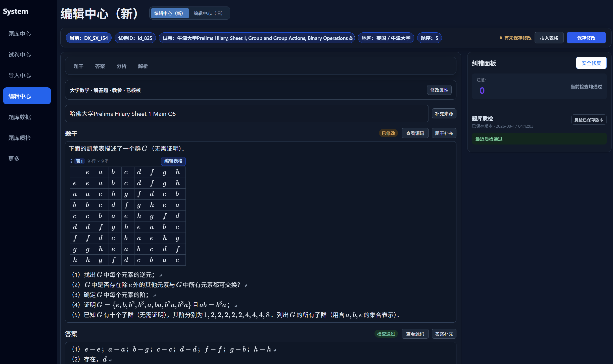

# DQ QuestionBank Core

[English](README.md) | **简体中文** | [中文产品站](https://wzsisshadiao-crypto.github.io/dq-questionbank-core/zh-CN/)

一个本地优先、开放、可扩展的可视化题库，围绕一道题从来源文档到经过核对的 Word 试卷构建完整工作流。

这是一个面向数学与教育场景的开源题库基础设施：支持中文题库、数学题库、题目管理、
可视化编辑、题库导入、LaTeX 公式、DOCX/Word、PDF、结构化表格、组卷、题库质检、
AI 辅助修正和多格式导出。题目内容可以使用中文或其他语言，公共技术接口仍以英文版本为准。



> 上图来自作者的成熟本地工作区，展示仓库所有者明确批准公开的示例题 `DX_SX_154` 及公开迁移目标。生产数据库、其他私有题目数据、密钥、供应商配置和维护记录均不随仓库发布。

## 快速开始

需要 Python 3.10 或更新版本：

```bash
python run.py
```

程序仅在本机回环地址启动服务，创建被 Git 忽略的本地工作区，并打开包含十道原创合成题的公共案例。

## 当前可以使用的功能

- 题库、编辑、组卷、导入、数据和质检工作区；
- 规范且带版本的题目 Schema；
- JSON、Markdown、LaTeX 和约定式 DOCX 导入导出；
- 离线 KaTeX 公式、结构化表格、答案与解析；
- 原子文件存储和只读 SQLite 公共案例；
- 插件发现、稳定公共 API 与兼容性 fixtures。

## 想参与贡献

不需要访问私有应用，也不一定需要编程经验：

- 有中文或多语言数学题：可以提交原创、合成或明确允许再分发的测试题；
- 熟悉 LaTeX：可以提供复杂公式、异常公式或公式渲染边界案例；
- 熟悉 Word：可以提供最小化的 DOCX 表格、分页、图片或公式案例；
- 熟悉 Python 或前端：可以认领小型测试、搜索体验和编辑器提示任务。

请先查看置顶的[测试题目征集 Issue](https://github.com/wzsisshadiao-crypto/dq-questionbank-core/issues/28)，
并阅读[测试 fixture 提交规范](docs/test-fixture-contributions.md)。所有材料都必须有清晰的来源、
许可证和再分发权；网上能看到的题目不等于可以复制到仓库。

## 题目工作流

```text
来源文档
  → 可定制导入
  → 结构化与校验
  → 人工核对
  → 编辑与题库质检
  → 组卷
  → JSON / DOCX 导出
```

成熟私有应用还包含更完整的 Word/PDF 流程、候选题核对、受约束的 AI 修正和 Word 宏发布。这些模块会在经过边界审查、合成 fixture 和兼容测试后逐步迁移到公开仓库；这里不把迁移目标描述成已经可下载的功能。

## 中文入口与英文规范

中文 README 和[中文产品站](https://wzsisshadiao-crypto.github.io/dq-questionbank-core/zh-CN/)
用于产品介绍、快速开始和社区沟通；产品站可以随时切换到 English。公共 API、CLI、Schema、Issue、
贡献规范和技术文档仍以英文版本为唯一规范来源，避免出现两套不一致的技术契约。

## 语言与开放边界

中文站和本文件是面向用户的本地化入口。公共 API 名称、CLI、Schema、Issue、贡献规范和技术文档仍以英文版本为唯一规范来源。题目内容本身支持多语言。

仓库绝不包含生产题库、真实用户数据、凭据、供应商配置或业务维护记录。详细边界见 [OPEN_SOURCE_BOUNDARY.md](OPEN_SOURCE_BOUNDARY.md)，贡献前请阅读 [CONTRIBUTING.md](CONTRIBUTING.md)。
