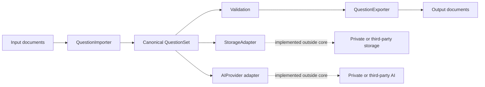
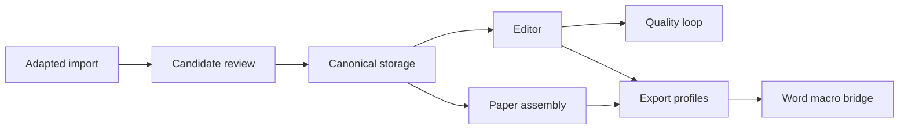

# OSS Architecture Proposal

## Decision

Use a small canonical interchange core as the dependency boundary, then migrate
the generic visual question-bank workflow on top of it in independently
reviewable batches. The goal is a useful local application, not only a schema
package and not a reduced copy of production code.

## Target architecture

The public application layer builds on this core:

## Why this split

The canonical model has independent value and a small trust boundary. Document
adapters need to understand formats, but not users, pricing, private IDs,
database tables, or providers. Storage and AI are extension points because they
have the highest deployment, privacy, and provider variability. Review,
editing, quality, paper assembly, and Word publishing can still be public when
they depend only on canonical contracts and synthetic fixtures.

## Public core

- Models and JSON Schema
- Validation
- Format interfaces and registry
- Generic built-in formats
- CLI and local playground

## Public application migration

- Local visual workspace and reviewed case adapters
- Generic source-evidence and candidate-review workflow
- Structured Editor Center and Question Quality Center
- Paper assembly independent of production storage
- Loopback-only Word macro bridge and refreshable reference blocks
- User-defined import profiles and plugin-based source adapters

## Private integration layer

- Mapping between private database rows and `QuestionSet`
- Production storage and media lifecycle
- Production authentication, authorization, and operator policy
- AI provider selection, private prompts, credentials, and private audit history
- Production databases, real content, logs, backups, and deployment details

## API shape

The primary API passes `QuestionSet` objects. Importers load a `Path`; exporters write to a `Path`. Optional keyword arguments carry format-specific paths or profiles without changing the canonical model.

## Migration plan

1. Keep the current private system unchanged.
2. Build and test the public core independently.
3. Add reviewed row-to-schema adapters behind the canonical boundary.
4. Rebuild generic workflow modules against synthetic fixtures and public APIs.
5. Compare document behavior against synthetic end-to-end fixtures.
6. Move one generic algorithm at a time only when its dependencies are explicit.
7. Never make the public core or application import a private module.

## Historical non-goals for 0.1

- Replacing the private web application
- Reproducing proprietary AI repair behavior
- Perfectly preserving arbitrary DOCX or LaTeX layout
- Defining a hosted multi-user service
- Publishing real question content

These constrained the initial core release. They do not prevent later public
application batches described in [Product Workflow and Public Migration](product-workflow.md).

