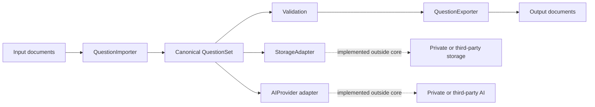

# OSS Architecture Proposal

## Decision

Build a small canonical interchange core rather than publishing a reduced copy of the private application.

## Target architecture

## Why this split

The canonical model has independent value and a small trust boundary. Document adapters need to understand formats, but not users, pricing, private IDs, database tables, or providers. Storage and AI are extension points because they have the highest deployment, privacy, and commercial variability.

## Public core

- Models and JSON Schema
- Validation
- Format interfaces and registry
- Generic built-in formats
- CLI and local playground

## Private layer

- Mapping between private database rows and `QuestionSet`
- Authentication and authorization
- Production storage and media lifecycle
- Commercial review and operational workflows
- AI selection, prompts, credentials, and audit policy

## API shape

The primary API passes `QuestionSet` objects. Importers load a `Path`; exporters write to a `Path`. Optional keyword arguments carry format-specific paths or profiles without changing the canonical model.

## Migration plan

1. Keep the current private system unchanged.
2. Build and test the public core independently.
3. Add a private row-to-schema adapter behind existing endpoints.
4. Compare private exports against canonical exports using synthetic fixtures.
5. Move one generic algorithm at a time only when its dependencies are explicit.
6. Never make the public core import a private module.

## Non-goals for 0.1

- Replacing the private web application
- Reproducing proprietary AI repair behavior
- Perfectly preserving arbitrary DOCX or LaTeX layout
- Defining a hosted multi-user service
- Publishing real question content

