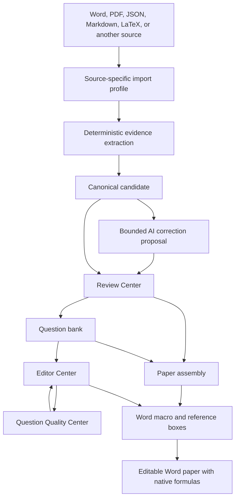

# Product Workflow and Public Migration

DQ QuestionBank is designed around the complete life of a question. Import is
not the end of the workflow, and export is not a blind serialization step. A
question remains traceable from its source evidence through normalization,
correction, review, editing, quality control, paper assembly, and publication.

This document describes both:

- the public capabilities that can be downloaded from this repository now; and
- the mature application workflow being extracted into the public project.

The distinction is deliberate. A feature described as a migration target is
working product behavior, but is not yet promised by the current public release.

## Status at a glance

| Status | Meaning |
|---|---|
| **Public now** | Implemented, documented, and tested in this repository |
| **Migration target** | Used by the mature application and planned for reviewed public extraction |
| **Private boundary** | Production data, secrets, provider wiring, and operational material that will not be published |

## One question, end to end



### 1. Choose or design the import route

Different sources encode a question differently. A teacher's Word template, a
publisher export, a scanned PDF, and an existing JSON bank should not be forced
through the same fragile parser. DQ therefore makes the import route an explicit
adapter.

The public core currently includes JSON, Markdown, LaTeX, and a documented DOCX
convention. `QuestionImporter`, `FormatRegistry`, and opt-in plugin discovery let
another application register its own format without changing the canonical
model.

The mature application extends this idea into process-based intake. A pipeline
can define, for example:

1. how question boundaries are recognized;
2. how source order, paragraphs, tables, images, and equations are captured;
3. how fields such as stem, choices, answer, analysis, and solution are mapped;
4. how subject, grade, source, and paper metadata are inferred or requested;
5. which deterministic cleanup rules run;
6. which ambiguities are eligible for AI assistance; and
7. which conditions require human review.

This is the main extensibility promise: users are not limited to the author's
document style. They can build an adapted import workflow for their own stable
conventions and still hand the result to the same editor, quality system,
storage boundary, and exporters.

### 2. Extract evidence before changing content

The deterministic stage should preserve what the source actually contains:
paragraph order, visible separators, formulas, images, tables, and enough local
context to explain how each field was derived. It creates a candidate and a
diagnostic record; it does not treat a successful parse as proof that the
question is correct.

This separation matters for difficult educational documents. A formula may be
represented as native Word math, text markup, or an image. A table may be part
of the stem rather than page decoration. A blank line may separate an answer
from a solution. Keeping evidence available makes later repair reviewable.

**Public now:** canonical models, source metadata, rich content blocks, asset
integrity validation, deterministic generated-format round trips, and a
convention-based DOCX adapter.

**Public now:** five installed synthetic intake routes share declarative field
mapping, file and excerpt digests, source locators, unmapped-field diagnostics,
and candidate sessions. Richer arbitrary-document extraction remains an adapter
responsibility rather than a promise that one parser understands every layout.

### 3. Normalize into a canonical candidate

Every importer produces the same versioned `QuestionSet` model. The model can
represent question types, multilingual content, LaTeX math, images, tables,
code, choices, answers, hints, solutions, source provenance, taxonomy, and
composite questions.

Normalization removes storage and presentation accidents from the question's
meaning. A production database row, a local JSON file, and a document block can
all represent the same canonical question. Validation then checks structural
requirements and rejects unsafe asset paths before the candidate moves on.

This canonical boundary is **public now**.

### 4. Apply AI as a bounded correction stage

AI is useful after deterministic extraction, especially when a source has
irregular labels, damaged formula text, or ambiguous field boundaries. It is
not treated as an authority and it is not allowed to silently overwrite source
evidence.

The intended flow is:

1. provide a candidate together with a limited source-evidence window;
2. request a structured correction, not unrestricted prose;
3. limit changes to the diagnosed fields;
4. compare the before and after validation results;
5. reject a proposal that introduces new errors or crosses its allowed scope;
6. send uncertain or materially changed questions to human review; and
7. keep provider credentials outside question data and public responses.

The public project contains the provider-neutral `AIProvider` protocol but no
built-in provider, credential, private prompt, or automatic persistence. The
candidate safety workflow is public in v0.7: proposals are bound to the mapped
candidate digest, limited to manifest-allowed fields, checked against exact
before values, validated, and always sent to explicit human review.

### 5. Review in context and assemble a paper

The Review Center is the human acceptance boundary. It presents import
candidates with their source identity, question fields, images, diagnostics,
and readiness state. Review is distinct from editing: the reviewer decides
whether the candidate belongs in the bank, needs revision, or should remain
blocked.

The mature application also connects review to paper assembly. A reviewer can
filter by subject or source and collect related questions, including a set from
the same source, into a paper. This avoids the common detour of approving
questions in one tool and rebuilding the paper manually in another.

The visual Review Center and paper integration remain **migration targets**.
The public CLI now implements the underlying accepted/rejected candidate state,
stale-decision protection, and reviewed export contract used by all five cases.

### 6. Correct with the Editor Center

The Editor Center treats a question as structured content rather than one large
text area. The mature workflow can edit:

- stem and supplemental stem content;
- choices and their column layout;
- answer, analysis, and solution;
- subject, type, grade, source, difficulty, and other metadata;
- inline and display formulas with rendered feedback;
- image placement and replacement; and
- structured tables and their markers.

The editor is also a destination. Search results, review candidates, and quality
findings can open the relevant question and return the user to the originating
workflow after the correction.

**Public now:** a focused visual editor for canonical JSON question sets. The
Editor Center supports structured choice editing (stable option ids, add/remove
rows, and single- or multiple-answer binding) plus reviewable metadata editing
for subject, grade, category, difficulty, tags, and source year/title. Save is
blocked when a choice answer points at a missing option, option ids collide, or
a choice question has incomplete options; the server repeats the canonical
validation before writing the local workspace. Formula delimiters entered while
editing are normalized back into canonical math blocks, and unchanged rich
blocks are retained. The public editor also exposes explicit saved, unsaved, and
saving states and warns before leaving the page with pending edits.

**Migration target:** the complete field editor, formula/image/table tooling,
navigation context, and paper integration.

### 7. Close the loop with the Question Quality Center

Quality control is not a one-time import check. Questions can become inconsistent
after editing, schema evolution, asset changes, or improved validation rules.
The mature Question Quality Center maintains a review queue across the bank and
groups findings by scope, severity, and cause.

A quality finding can be:

- opened in the Editor Center at the affected question and field;
- rechecked after a manual edit;
- marked as reviewed when it is a known false positive; or
- repaired only after an exact preview and a bound confirmation step when a
  deterministic, low-risk repair exists.

The key architectural point is the loop: **detect -> inspect -> edit or preview
repair -> save -> recheck**. Quality state is derived from question content; it
does not become a second source of truth.

The full quality workflow is a **migration target**. Public extraction will use
synthetic findings and generic rules, not private correction history.

### 8. Export for interchange or for real Word authoring

The project distinguishes semantic interchange from document publishing.

#### Portable export

The public core exports canonical JSON, generated Markdown, generated LaTeX,
and a conventional DOCX representation. These formats are appropriate for API
exchange, versioning, downstream conversion, and simple documents. JSON is the
highest-fidelity representation of the canonical model.

#### Primary high-fidelity Word workflow

The mature application's main publishing route is a local Word macro workflow.
It is designed for people who continue editing and arranging a paper inside
Microsoft Word:

1. In Word, place the cursor where a question should appear.
2. Invoke the macro and identify one question or a batch assembled in the
   question-bank application.
3. The macro creates a rich Word content control: a **question reference box**.
4. A loopback-only local helper renders the selected question into that box.
5. LaTeX math is converted to native Word math (OMML) when supported; pictures,
   tables, choices, answers, analysis, and solutions follow the selected render
   profile.
6. Continue arranging the paper with normal Word tools. Reference-box borders
   can remain visible while composing and be hidden for delivery.
7. If a question changes in the bank, refresh one reference box or all boxes
   instead of rebuilding the document manually.

This approach is more than "export a DOCX." It separates question identity from
its rendered copy. The document stays editable, formulas remain Word-native,
and the author can refresh managed question blocks while retaining the
surrounding paper layout.

The generic macro/helper contract is a **migration target**. Public extraction
must be loopback-only, must not expose a private database schema, and must use
synthetic questions in all tests and examples.

## Designing a custom import pipeline

A custom pipeline should be a composition of small, testable stages:

```text
untrusted source
    -> source adapter
    -> deterministic evidence
    -> canonical candidate
    -> validation
    -> optional bounded enrichment
    -> review decision
    -> storage adapter
```

At the smallest level, implement and register a `QuestionImporter`:

```python
from dq_questionbank import FormatRegistry

registry = FormatRegistry()
registry.register_importer(MySchoolDocumentImporter())
question_set = registry.importer("my-school-docx").load(source_path)
```

Reusable packages can expose an opt-in registrar through the documented
`dq_questionbank.plugins` entry-point group. Discovery is never automatic:
loading plugin code is an explicit application decision.

An application-specific pipeline can add preprocessing, evidence capture,
review policy, and metadata routing around that importer. It should not embed
credentials in a question, let an AI provider write storage directly, or bypass
canonical validation.

## Why the architecture is distinctive

The project's originality is in how the parts are separated and then rejoined
into one practical workflow:

1. **The source remains evidence.** Parsing and AI correction do not erase the
   basis for a human decision.
2. **A candidate is not a stored question.** Import success, correction,
   acceptance, and persistence are separate states.
3. **Question meaning is independent of the database and document.** The
   canonical model is shared by adapters, the visual application, quality
   checks, storage, and export.
4. **Import is user-adaptable.** New source conventions become plugins or
   profiles rather than forks of the whole application.
5. **Editing and quality control form a closed loop.** Findings lead to an exact
   field, and saved revisions are re-evaluated.
6. **Paper assembly is connected to review.** Questions can move from a source
   batch into an actual paper without losing provenance.
7. **Word is treated as an active authoring environment.** Refreshable reference
   boxes and native formulas preserve a workflow that static export usually
   discards.
8. **AI, storage, and presentation are replaceable edges.** The model does not
   belong to one provider, database, frontend, or office format.

These are defensible design properties, not a claim that no other system has
ever used an individual technique.

## Public migration sequence

The public migration is intentionally incremental so each batch remains usable
and independently reviewable.

1. **Foundation, complete:** canonical model, validation, migrations, stable
   public API checks, format adapters, plugins, atomic filesystem storage, CLI,
   documentation, CI, and deterministic Wiki tooling.
2. **Visual local workspace, first batch complete:** one-command launcher,
   question list/editor, canonical JSON import/save/export, read-only SQLite case
   adapter, and a synthetic database case.
3. **Import and review, CLI contract complete:** generic import sessions, source
   evidence, bounded proposals, candidate review, and five adapted-pipeline cases.
4. **Daily question work:** fuller editor, generic quality findings, recheck loop,
   and paper assembly over canonical storage.
5. **Word publishing:** reviewed loopback macro bridge, refreshable question
   reference boxes, native formula rendering, layout profiles, and synthetic
   end-to-end fixtures.

No migration batch will copy a private production module wholesale. Generic
behavior is extracted behind public contracts and verified with synthetic data.

## What remains private

The intended open-source surface is broad, but a small boundary remains:

- production databases, backups, real question collections, and uploaded media;
- API keys, credentials, provider configuration, and private account data;
- private prompts or learned correction history that may contain source content;
- logs, traces, maintenance history, recovery artifacts, and local paths;
- deployment-specific authorization, billing, and operator configuration; and
- third-party content that cannot legally be redistributed.

See [Open-Source Boundary](../OPEN_SOURCE_BOUNDARY.md) for the normative policy.
